# Investigación del Crimen en SQL City

## Datos de la Detective

Actividad: Investigación del crimen en SQL City <br>
Detective: Laura Katherine Areiza Henao <br>
Curso: Estructura de Datos <br>
Herramienta utilizada: SQL <br>

## Resumen del Caso

En esta investigación se analizó la base de datos de SQL City para encontrar al culpable de un asesinato ocurrido el 15 de enero de 2018.

A partir del reporte del crimen, las entrevistas de los testigos y el análisis de registros del gimnasio y licencias de conducción, se logró identificar al culpable.

Después de seguir todas las pistas y cruzar la información encontrada en diferentes tablas, se determinó que el asesino fue Jeremy Bowers.

## Bitácora de Investigación

A continuación se documenta el proceso de investigación paso a paso, mostrando las consultas realizadas y las conclusiones obtenidas.

### 1. Reporte del crimen

Primero se buscó el reporte del crimen en la fecha y ciudad indicadas.

```sql
Select * From crime_scene_report
WHERE date = "20180115" AND city = "SQL City";
```

El reporte indica que existen dos testigos:

- Un testigo cuyo nombre no se conoce, pero vive en la última casa de Northwestern Dr.
- Una testigo llamada Annabel, que vive en Franklin Ave. 

<br>

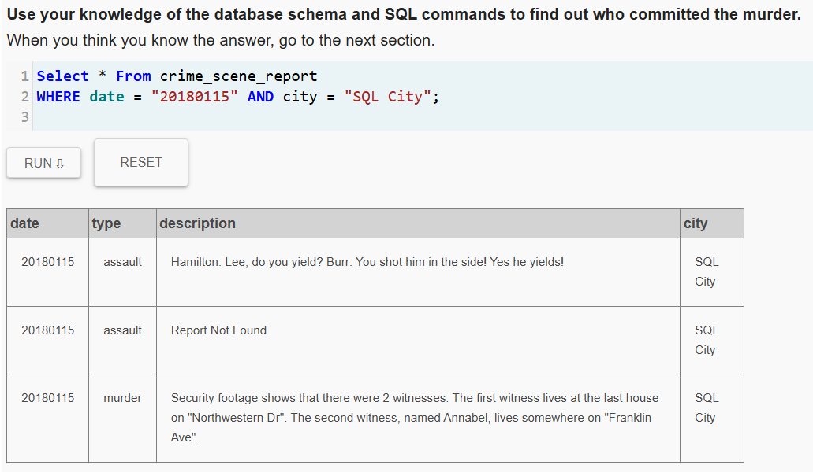

### 2. Buscar a la testigo Annabel

Se decidió comenzar por Annabel, ya que se conoce su nombre y la calle donde vive.

```sql
Select * from person
WHERE name LIKE ("%Annabel%");
```

Se descubrió que su nombre completo es:

- Annabel Miller
- Además, se identificó su ID: 16371, lo que permite buscar su entrevista.

<br>

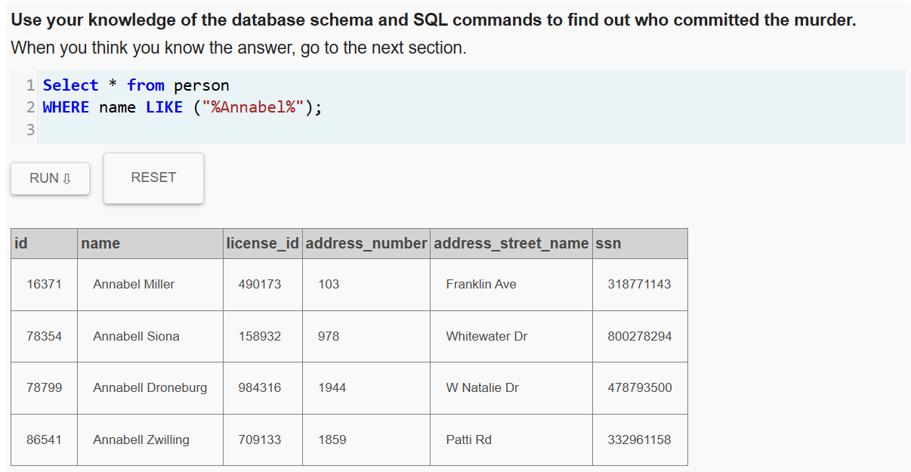

### 3. Entrevista de Annabel

Se buscó la entrevista realizada a la testigo.

```sql
Select * from interview
	Join person
		On interview.person_id = person.id
Where id = "16371";
```

Annabel declaró que reconoció al asesino el 9 de enero cuando estaba entrenando en el gimnasio.

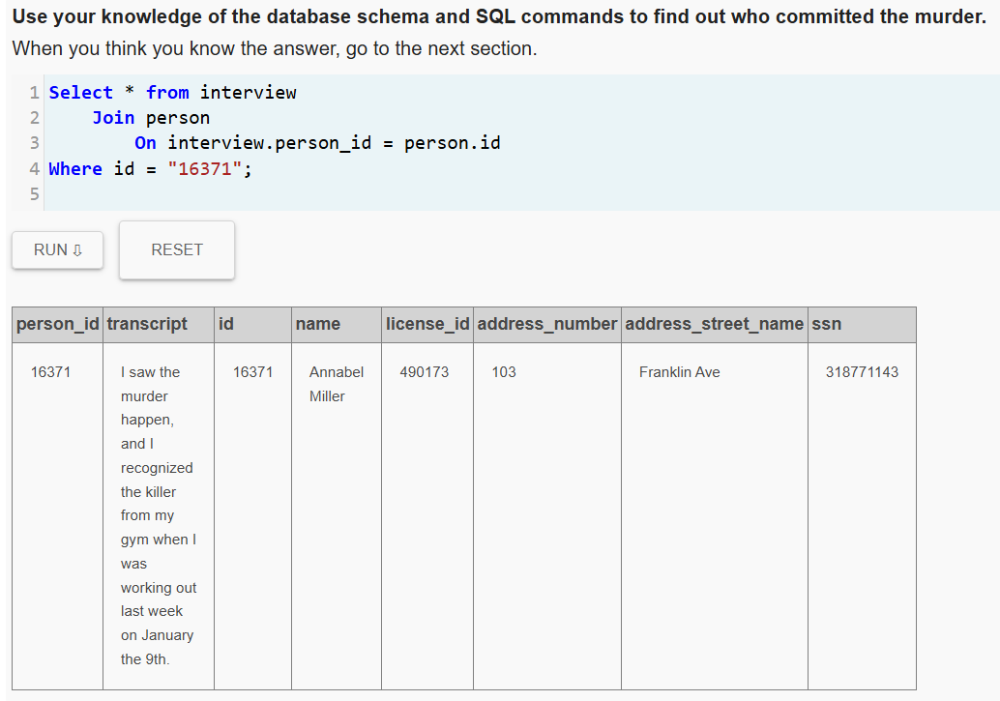

### 4. Personas que fueron al gimnasio el 9 de enero

Con la información anterior, se buscó quiénes entraron al gimnasio ese día.

```sql
Select * from get_fit_now_check_in
where check_in_date LIKE ("%20180109%");
```

Se encontraron 10 personas que ingresaron al gimnasio ese día, por lo que el sospechoso debe estar entre ellas.

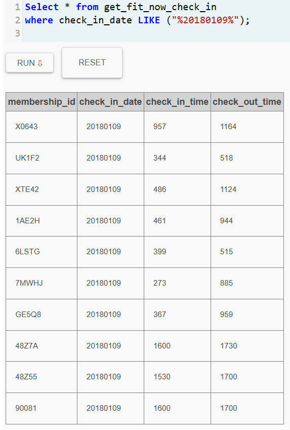

### 5. Buscar al segundo testigo

El segundo testigo vive en la última casa de Northwestern Dr, por lo que se buscaron las personas de esa calle.

```sql
Select * from person
WHERE address_street_name LIKE ("%Northwestern%")
ORDER BY address_number DESC
LIMIT 5;
```

Se descubrió que el testigo es:

- Morty Schapiro
- ID: 14887

<br>

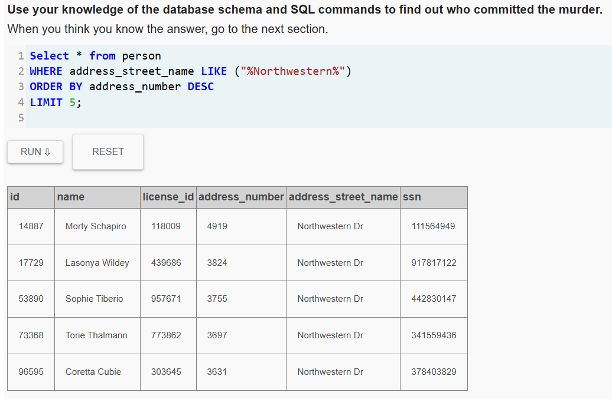

### 6. Entrevista del segundo testigo

Se consultó la entrevista de Morty Schapiro.

```sql
Select * from interview
	Join person
		On interview.person_id = person.id
Where id = "14887";
```

El testigo indicó dos pistas importantes:

- El asesino tiene membresía gold en el gimnasio que empieza con "48Z".
- El asesino escapó en un auto con matrícula que incluye "H42W".

<br>

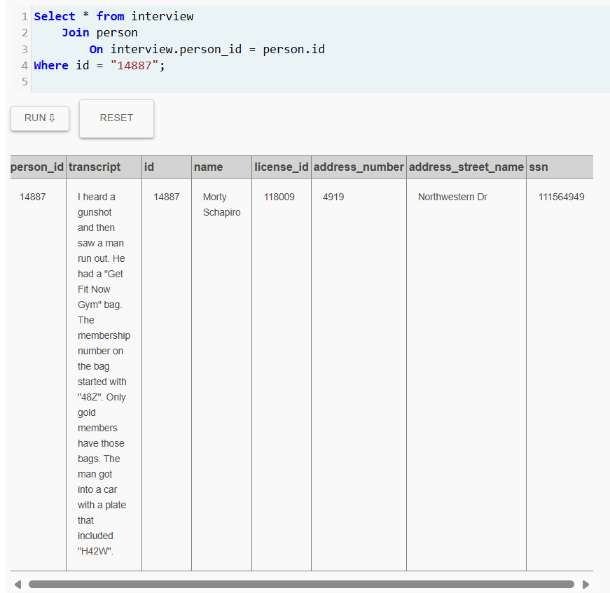

### 7. Buscar membresías del gimnasio

Se buscaron las membresías del gimnasio que coincidan con 48Z y que hayan ingresado el 9 de enero.

```sql
Select * from get_fit_now_check_in
WHERE membership_id LIKE ("%48z%") and check_in_date = "20180109";
```

Se encontraron dos coincidencias:

- 48Z7A
- 48Z55

Uno de ellos debe ser el asesino.

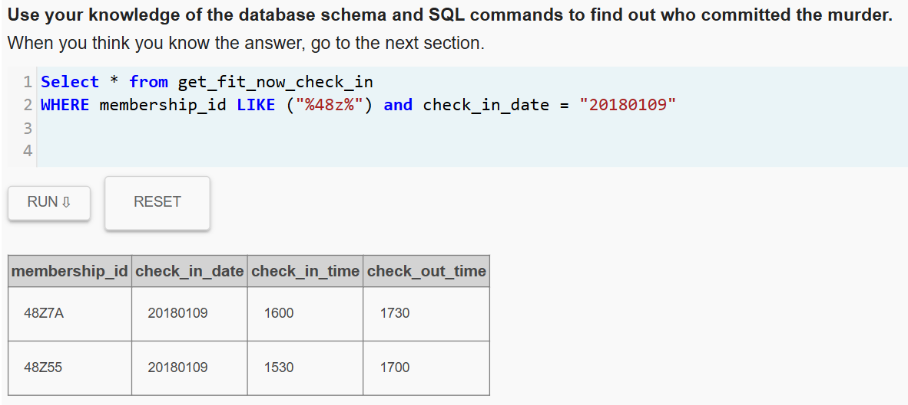

### 8. Buscar autos con la matrícula

Se investigaron los vehículos con matrícula H42W.

```sql
Select * from drivers_license 
WHERE plate_number LIKE ("%H42W%");
```

Se encontraron tres licencias relacionadas:

- 183779
- 423327
- 664760

<br>

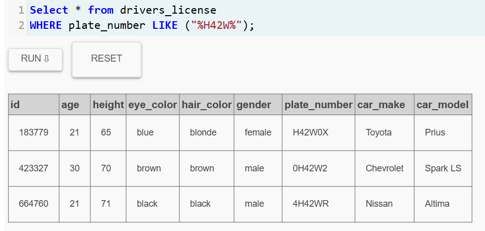

### 9. Primer sospechoso (48Z7A)

Se buscó a quién pertenece la membresía 48Z7A.

```sql
Select id, person_id, name from get_fit_now_member
	Join get_fit_now_check_in
		ON id = get_fit_now_check_in.membership_id
		
Where id = "48Z7A"
```

Esta membresía pertenece a:

- Joe Germuska
- ID: 28819

<br>

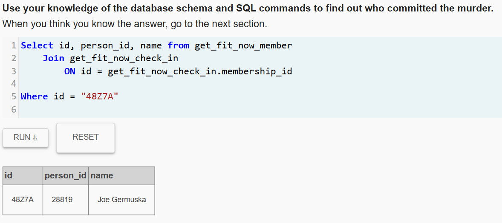

### 10. Segundo sospechoso (48Z55)

Se investigó la segunda membresía.

```sql
Select id, person_id, name from get_fit_now_member
	Join get_fit_now_check_in
		ON id = get_fit_now_check_in.membership_id
		
Where id = "48Z55"
```

Esta membresía pertenece a:

- Jeremy Bowers
- ID: 67318

<br>

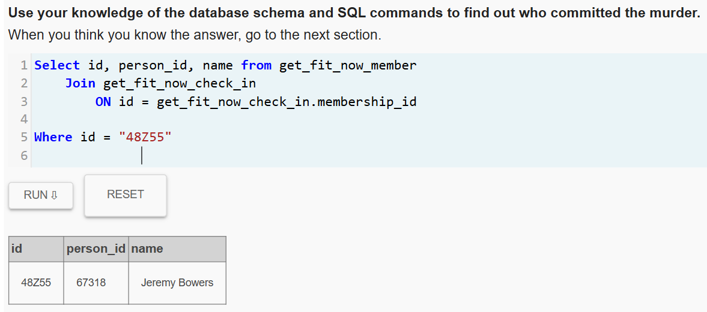

### 11. Verificar licencia de Joe Germuska

Se verificó si la licencia de Joe Germuska coincide con las placas sospechosas.

```sql
Select * from person
Where id = "28819" and license_id IN ("183779", "423327", "664760");
```

No se encontró coincidencia con las licencias sospechosas.

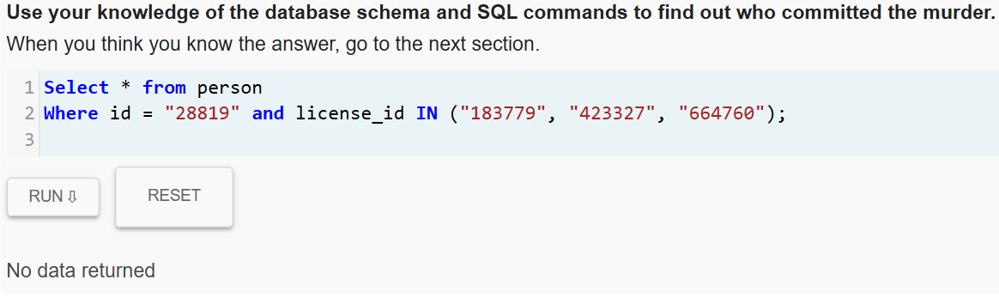

### 12. Verificar licencia de Jeremy Bowers

Se revisó el segundo sospechoso.

```sql
Select * from person
Where id = "67318" and license_id IN ("183779", "423327", "664760");
```

La licencia de Jeremy Bowers sí coincide con una de las licencias relacionadas con la matrícula H42W.

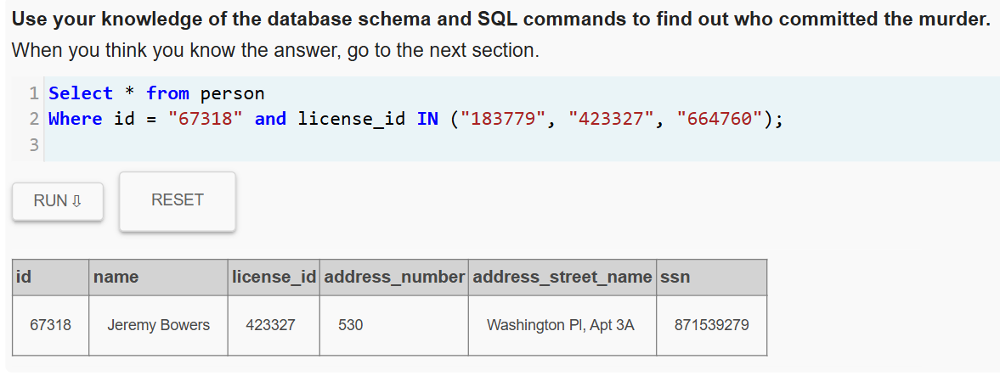

## Conclusión de la Investigación

Con toda la evidencia recopilada se puede concluir que:

**Jeremy Bowers** es el asesino.

Para confirmar la solución en la plataforma se ejecutó la siguiente consulta:

```sql
INSERT INTO solution VALUES (1, 'Jeremy Bowers');
        SELECT value FROM solution;
```

.png)

### 13. Nueva pista del asesino

Aunque ya se identificó al asesino, al revisar su entrevista se descubrió información adicional sobre quién lo contrató.

```sql
Select * from interview
	Join person
		On interview.person_id = person.id
Where id = "67318";
```

En la entrevista, Jeremy Bowers confesó que fue contratado por una mujer que:

- Mide entre 1.65 y 1.70
- Tiene cabello rojo
- Conduce un Tesla Model S

Asistió al concierto sinfónico de SQL tres veces en diciembre de 2017

.png)

### 14. Buscar mujeres pelirrojas que conduzcan Tesla

Con la información obtenida, se buscó en la tabla de licencias de conducción mujeres que coincidan con esas características.

```sql
SELECT * FROM drivers_license
WHERE gender = "female" 
AND hair_color = "red" 
AND car_make LIKE ("%Tesla%");
```

Se encontraron tres posibles sospechosas con los siguientes ID de licencia:

- 202298
- 291182
- 918773

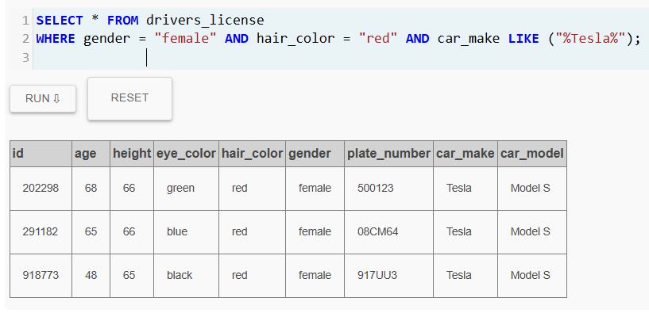

### 15. Identificar a las personas correspondientes

Luego se buscó en la tabla de personas quiénes corresponden a esas licencias.

```sql
SELECT * FROM person
	JOIN drivers_license
		ON person.license_id = drivers_license.id	
WHERE license_id IN ("202298", "291182", "918773");
```

Se encontraron tres mujeres:

- Miranda Priestly (ID: 99716)
- Regina George (ID: 90700)
- Red Korb (ID: 78881)

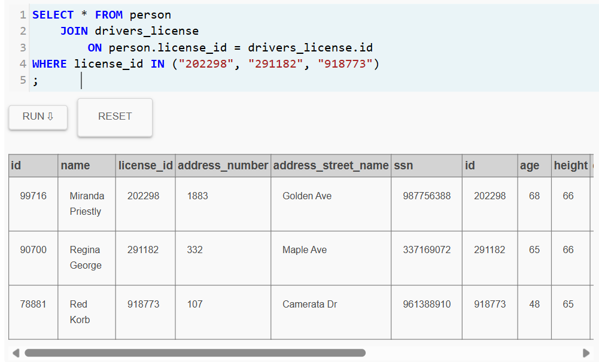

### 16. Buscar asistencia al concierto sinfónico de SQL

Se investigó cuáles de estas sospechosas asistieron tres veces al concierto sinfónico de SQL en diciembre de 2017.

```sql
SELECT * FROM facebook_event_checkin
WHERE event_name LIKE ("%%") 
AND date LIKE ("%201712%");
```

Se encontró coincidencia con el ID 99716.

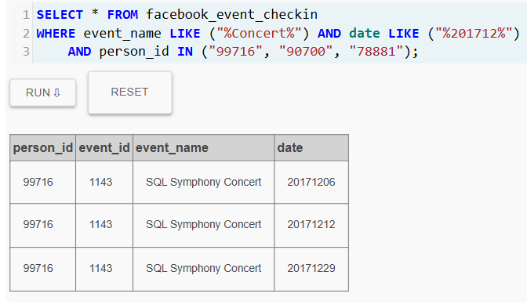

### 17. Confirmar identidad de la sospechosa

Finalmente, se consultó la información de la persona con ese ID.

```sql
SELECT * FROM person
WHERE id = "99716";
```

Se confirmó que la persona corresponde a Miranda Priestly.

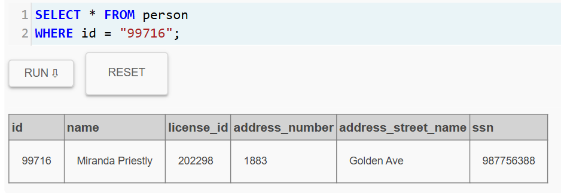

## Conclusión Final de la Investigación

Después de analizar todas las pistas y cruzar la información de las diferentes tablas, se determinó que:

- Jeremy Bowers fue quien cometió el asesinato.
- Sin embargo, Miranda Priestly fue la persona que lo contrató para llevarlo a cabo.

Para confirmar la solución final en la plataforma se ejecutó la siguiente consulta:

```sql
INSERT INTO solution VALUES (1, 'Miranda Priestly');
        SELECT value FROM solution;
```

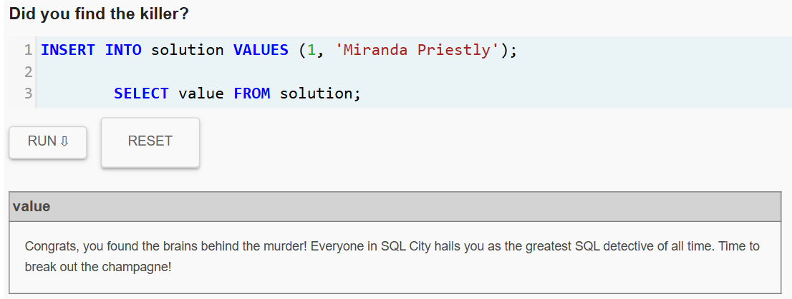
